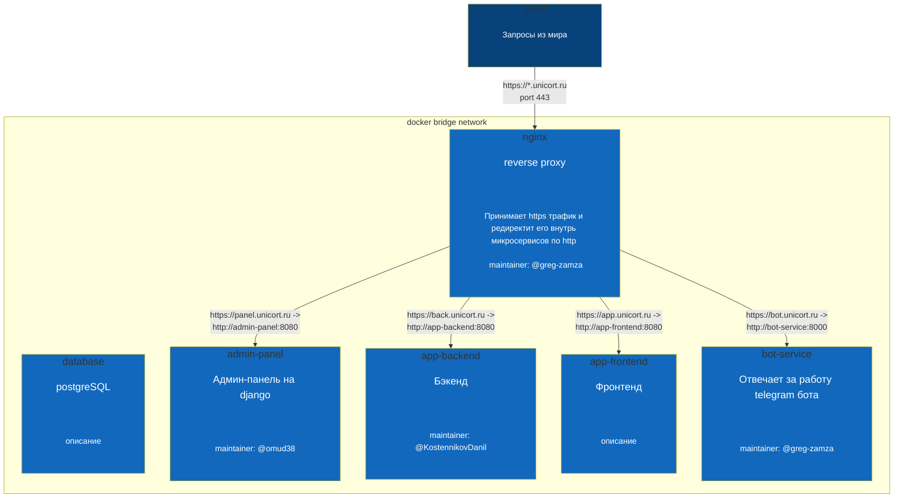

# Об архитектуре проекта
## Общая топология

## Пояснение
1) `bridge-network` - это изолированная сеть, в которой находятся все контейнеры. Все они могут пинговать друг друга по имени контейнера вместо доменного имени. Например, запрос из `app-backend` в `database` будет проходить по `database:5432`
> [!IMPORTANT]
> Контейнеры доступны только внутри изолированной сети (у них нет торчащих наружу портов)! Всё проксируется только через `nginx`!

2) Если необходимо обращаться к контейнеру извне (например, с фронтенда в `app-backend`, это можно делать *исключительно по https и закреплённому за микросервисом доменному имени*. Например, запрос на бэкенд будет выглядеть так: `https://back.unicort.ru`
> [!WARNING]
> Не нужно хардкодить URL для обращения к микросервисам извне. URL на dev и prod средах отличаются и они могут меняться. *Берите URL и все остальные переменные, зависящие от dev/prod среды из __переменных окружения__ или из __.env__* .
>
> URL любого микросервиса вы можете получить из переменной `имя-сервиса-URL`
> 
> `const botServiceURL = process.env.bot-service-URL;`

Актуальные имена контейнеров можно узнать из схемы выше, которая постоянно обновляется. Список редиректов из nginx в контейнеры содержится в [README сервиса nginx](nginx/prod/README.md)  [(dev)](nginx/dev/README.md). Тут можно посмотреть названия переменных окружения и сами URL. 

## Правила оформления микросервисов
> [!IMPORTANT]
> - В каждом микросервисе должен быть файл `compose.yaml`, соотвествующий референсу
> - Нейминг должен соответствовать стандарту: lower case и разделение слов с помощью тире. Например: `app-frontend`
> - Название директории желательнно должно совпадать с названием микросервиса
> - Каждый микросервис должен содержаться в своей директории, даже если он состоит из одного compose.yaml, как database
# TennisProject
